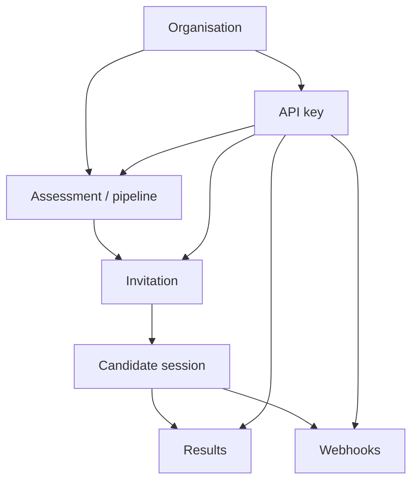

Your team designs the hiring experience. Candidates complete it in Assess. Scores and events come back through the dashboard, Public API, or signed webhooks.

## How Assess works

Instead of embedding a full hiring UI in your own app, you work with a small set of building blocks.

Your application (or the Assess dashboard) belongs to an **organisation**. You create **assessments** or **pipelines**, then **invite** candidates. Every automated action uses an organisation API key and is limited by that key’s **scopes**.

Candidates complete work inside Assess. You review results in the dashboard, or your software listens for **webhooks** and reads results over the API.

Assess is responsible for running sessions, scoring, and delivering signed events. You are responsible for who holds API keys, which scopes they have, and how your ATS or automations react.

## Core concepts

- **Organisation** — Your Assess workspace. Owns plan limits, seats, assessments, and API keys.
- **Assessment** — A take-home or timed test. Must be **Active** before invites work. Identified by **slug** (or UUID), not title alone.
- **Task / case** — One question on an assessment (`platform` library or your `org` library).
- **Invitation** — One candidate’s unique link. In the API the id is **`invite_token`**.
- **Result** — That candidate’s score, pass/fail, and optional proctoring signals.
- **Pipeline** — Multi-stage funnel. You design stages in the dashboard; the API enrolls people and reports status.
- **Interview** — Live AI, human, or hybrid room (separate from async assessments).
- **Webhook** — HTTPS URL Assess calls when something happens. Secret `whsec_…` is shown once.
- **API key** — `ct_live_…` (live) or `ct_test_…` (test) Bearer credential (Starter+). Created under **Developer → API Keys** by owners, admins, or [developers](/guides/roles). Empty scopes mean full access (legacy).
- **Hiring squad** — Growth+ sub-team used to filter assessments and pipelines.

## Where to start

- **Explore by use case** — [Technical assessments](/guides/assessments), [Interviews & pipelines](/guides/pipelines), [ATS & automations](/integrations/automations)
- **Team access** — [Team roles](/guides/roles) (invite a **developer** for API keys without granting billing)
- **Account / API key** — [create a key](/guides/authentication) (or stay in the [dashboard](https://assess.praxicraft.com/assess) with no key)
- **SDKs** — [Python, Node.js, Go](/sdks/introduction)
- **First invite** — [Quickstart](/guides/quickstart)
- **AI-ready docs** — [Build with agents](/integrations/build-with-agents), [Using docs with LLMs](/integrations/using-llms), and [MCP](/integrations/assess-mcp)
