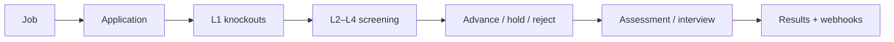

Your organisation designs hiring in Assess. Candidates apply, take assessments, and join interviews inside the product. You review in the dashboard, or your software listens over the Public API and signed webhooks.

## What Assess is for

Assess helps you hire **data talent** end to end:

1. **Attract** — publish a job on careers with a custom application form and knockout questions.
2. **Screen** — rank CVs with a deterministic match score; optional AI briefs assist humans, they never reorder the list.
3. **Assess** — send take-homes with coding, SQL, and other tasks in a live sandbox.
4. **Interview** — run AI, human, or hybrid live rooms with analysis and replay.
5. **Decide** — keep notes, tags, and scorecards on one candidate profile across jobs.

You can still skip jobs entirely and only send assessment invites. That path remains fully supported.

## How Assess works

Work happens inside an **organisation**. Recruiters use the [dashboard](https://assess.praxicraft.com/assess) with no API key. Automations use organisation API keys limited by **scopes**.

Assess runs sessions, scores tasks, screens applications, and delivers webhooks. You control who holds keys, which scopes they have, and how your ATS reacts.

Assessment-only path: create an **assessment** → send an **invitation** → read **results** (and webhooks). No job required.

## What you can do today

| Area | You can… | Guide |
|------|----------|--------|
| Jobs | Create openings, fields, knockouts; publish/close; collect applications | [Jobs & applications](/guides/jobs) |
| Screening | Set match requirements; rank by L3 score; hold/advance; optional Growth+ AI brief | [Screening](/guides/screening) |
| Candidate CRM | Notes, tags, scorecards, merge duplicates across the org | [Candidate profiles](/guides/candidates) |
| Assessments | Build active tests from platform or org tasks | [Assessments](/guides/assessments) |
| Invitations | Single or bulk invite links, reminders, expiry | [Invitations](/guides/invitations) |
| Results | Scores, pass/fail, per-task outcomes | [Results](/guides/results) |
| Proctoring | Integrity signals for human review (never auto-fail) | [Proctoring](/guides/proctoring) |
| Interviews | AI / human / hybrid rooms, analysis, replay | [Live interviews](/guides/interviews) |
| Pipelines | Multi-stage funnels, including `cv_screen` with jobs | [Pipelines](/guides/pipelines) |
| Webhooks | Signed events for jobs, applications, screening, assessments, interviews, offers | [Webhooks](/guides/webhooks) |
| Soft offers | Letter + PDF + accept/decline after hire (Growth+; not e-sign) | [API Reference](/guides/api-reference) |
| Organisation | Plan limits, seats, hiring squads, audit log | [Organisation](/guides/organisation) |

## Core concepts

- **Organisation**: Your Assess workspace. Owns plan limits, seats, jobs, assessments, and API keys.
- **Job**: A published opening (careers + API). Optional.
- **Application**: One person’s apply to a job.
- **Screening (L1–L5)**: Knockouts → CV parse → **L3 match score** (sort key) → optional L4 AI brief → human or threshold advance.
- **Candidate profile**: Org CRM person (`profiles:*`). Not the same as assessment session results (`candidates:read`).
- **Assessment**: Take-home or timed test. Must be **Active** before invites. Identified by **slug** or UUID.
- **Task**: One question on an assessment (`platform` or `org` library).
- **Invitation**: One candidate’s unique link. API id: **`invite_token`**.
- **Result**: Score, pass/fail, optional proctoring signals.
- **Pipeline**: Multi-stage funnel. Linked jobs can use a `cv_screen` stage.
- **Interview**: Live AI, human, or hybrid room.
- **Soft offer**: Letter + PDF + accept/decline link (`offers:*`, Growth+). Not DocuSign.
- **Webhook**: HTTPS callback. Secret `whsec_…` shown once.
- **API key**: `ct_live_…` or `ct_test_…` Bearer (Starter+). Empty scopes = full access (legacy).
- **Hiring squad**: Growth+ sub-team for filtering jobs, assessments, and pipelines.

## Where to start

<CardGroup cols={2}>
  <Card title="Post a job" icon="briefcase" href="/guides/jobs">
    Careers apply → screen → advance into assessment.
  </Card>
  <Card title="Invite to an assessment" icon="mail" href="/guides/quickstart">
    Quickstart for assessment-only hiring.
  </Card>
  <Card title="Team roles" icon="users" href="/guides/roles">
    Invite a developer for API keys without billing access.
  </Card>
  <Card title="Create an API key" icon="key" href="/guides/authentication">
    Or stay in the dashboard with no key.
  </Card>
</CardGroup>

[SDKs](/sdks/introduction) · [Build with agents](/integrations/build-with-agents) · [Using docs with LLMs](/guides/using-llms) · [MCP](/integrations/assess-mcp)
