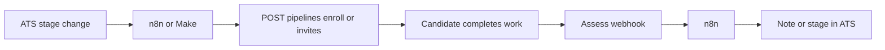

Not every ATS has a Harvest-class partner API. For **Dover**, **Binary**, **TalentHR**, **Indeed**, and similar tools, connect through Assess **outbound webhooks** + the **Public API** (or [n8n](/integrations/n8n) / [Zapier](/integrations/zapier)). This is the same long-tail pattern used across technical hiring platforms.

## When to use this path

| Use native ATS connectors | Use this guide |
|---------------------------|----------------|
| Greenhouse, Lever, Ashby, Workday, BambooHR, Zoho Recruit, Breezy HR | Dover, Binary, TalentHR, Indeed, custom ATS |
| Growth+ one-click / API-key connect in **Settings → Integrations** | Any plan that can create webhooks + API keys |

Free ATS plans often **cannot** fire outbound webhooks to Assess. In that case, poll Public API enrollment/results or upgrade the ATS plan.

## Recipe

1. Create a destination in **Developer → Destinations** (or Public API `POST /webhooks/create/`).
2. Subscribe to the events you need — at minimum `candidate.passed`, `candidate.failed`, and for funnels `pipeline.enrolled`, `pipeline.advanced`, `pipeline.completed`, `pipeline.rejected`, `pipeline.held`, `pipeline.unheld`.
3. When a candidate hits your ATS screen stage, call:
   - `POST /api/v1/public/pipelines/{slug}/enroll/` **or**
   - `POST /api/v1/public/assessments/{slug}/invites/`
4. On Assess webhook delivery, write a note / move the stage in your ATS using their API.

Store the ATS candidate id as `external_id` on invite when available so score-back can join records.

## Indeed

Indeed is primarily a **job board / apply feed**, not a full ATS note-push API. Treat applications as a source: export or webhook applicants into n8n → Assess enroll/invite. Do not expect Greenhouse-style application notes.

## Next

[Webhooks](/guides/webhooks) · [Integrations](/integrations/overview) · [Pipelines](/guides/pipelines) · [n8n](/integrations/n8n) · [Make](/integrations/make)
